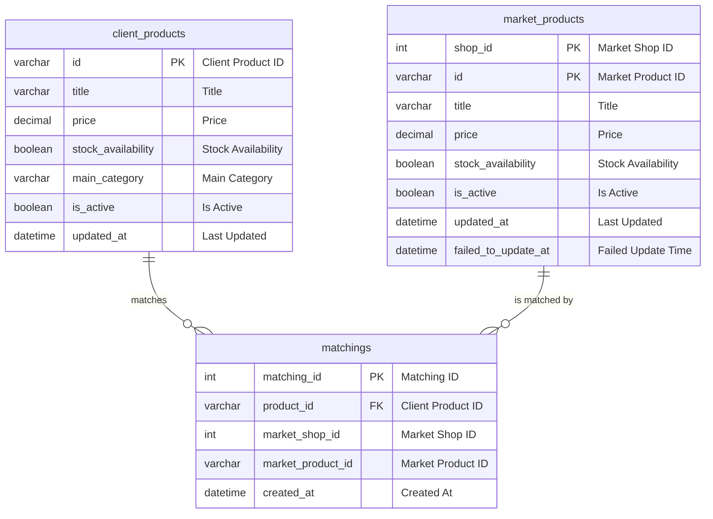

```mermaid
    erDiagram
        client_products {
            varchar id PK "Client Product ID"
            varchar title "Title"
            decimal price "Price"
            boolean stock_availability "Stock Availability"
            varchar main_category "Main Category"
            boolean is_active "Is Active"
            datetime updated_at "Last Updated"
        }

        matchings {
            int matching_id PK "Matching ID"
            varchar product_id FK "Client Product ID"
            int market_shop_id "Market Shop ID"
            varchar market_product_id "Market Product ID"
            datetime created_at "Created At"
        }

        market_products {
            int shop_id PK "Market Shop ID"
            varchar id PK "Market Product ID"
            varchar title "Title"
            decimal price "Price"
            boolean stock_availability "Stock Availability"
            boolean is_active "Is Active"
            datetime updated_at "Last Updated"
            datetime failed_to_update_at "Failed Update Time"
        }

        client_products ||--o{ matchings : "matches"
        market_products ||--o{ matchings : "is matched by"

        %% Composite FK clarification
        %% matchings.market_shop_id + matchings.market_product_id --> market_products.shop_id + market_products.id

        %% Uniqueness note:
        %% matchings has UNIQUE(product_id, market_shop_id, market_product_id)
```
